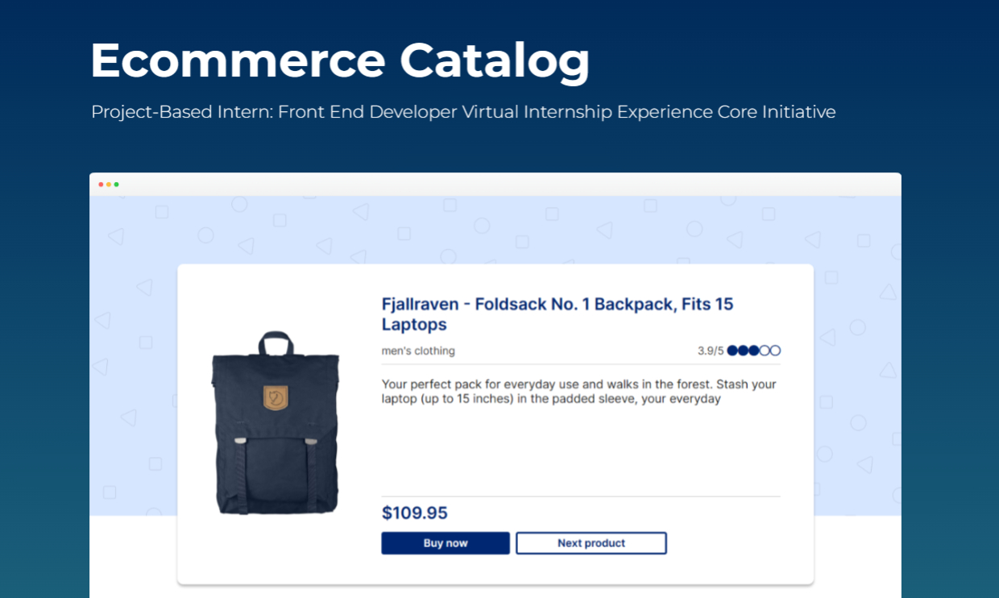
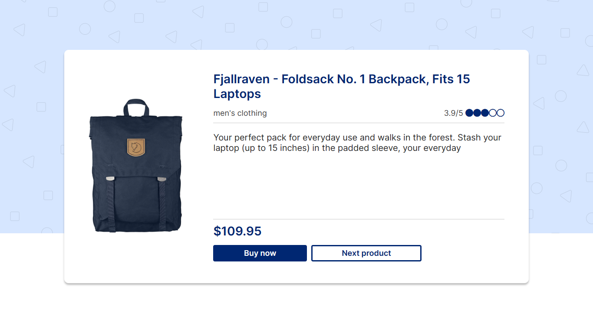
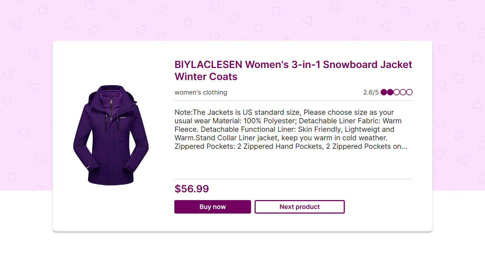
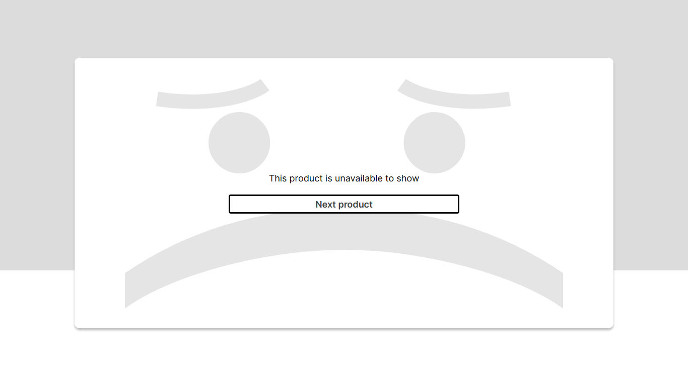

# 🛒 E-Commerce Catalog 🛒

Project-Based Intern: Front End Developer Virtual Internship Experience Core Initiative



This is a simple E-Commerce application built using Vue.js version 2. It accesses the [FakeStoreAPI](https://fakestoreapi.com/) to fetch product data and display it in a user-friendly manner. User can view the products by clicking the "Next Product" button, and the app will fetch the products from the API with an incrementing index number. The app checks the product's category and displays it accordingly on one of the three pages: men's section, women's section, or unavailable product.

## Live Demo

[Click here for demo](https://ecommerce-catalog-rans.vercel.app)

## Features

- Accesses the [FakeStoreAPI](https://fakestoreapi.com/) to fetch product data
- Implements pagination with a Next button to load the next set of products
- Displays a loading spinner while waiting for data to load
- Dynamically applies CSS styles based on the product category

## Tech/Framework Used

- Vue.js
- Javascript

## Installation

Clone the repository to your local machine:

```bash
  git clone https://github.com/ranuwahyudy/ecommerce-catalog.git
```

Change into the project directory:

```bash
  cd ecommerce-catalog
```

Install the necessary dependencies:

```bash
  npm install
```

Run the development server:

```bash
  npm run serve
```

## Screenshots






